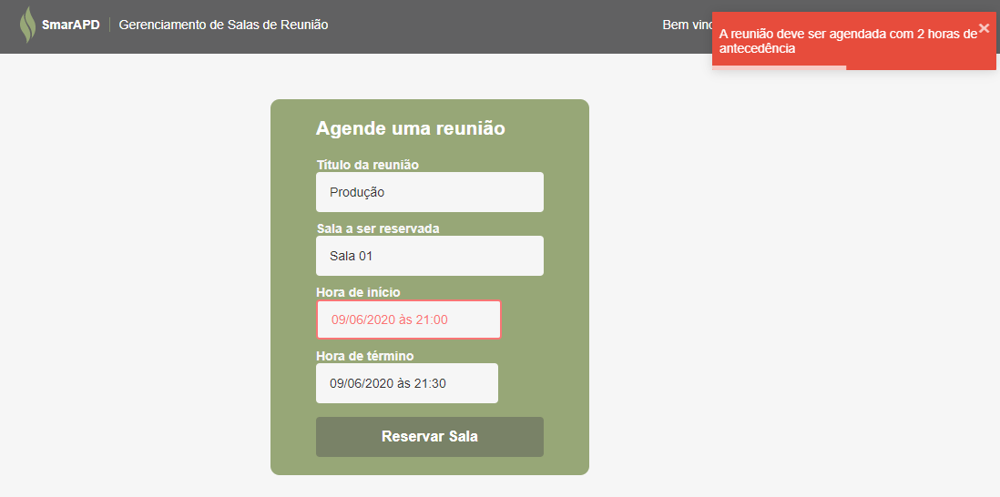

# Teste SmarAPD

Por Erick Vieira

Este repositório é dedicado a um sistema teste proposto pela empresa **SmarAPD**.
A idéia é o gerenciamento das salas de reunião, para isso o sistema compreende uma API REST que armazena as salas de reunião, os usuários e as reuniões. Faz as autenticação de usuários, armazena as novas reuniões validando se os horários não são conflitantes. A interface com o usuário permite o login e possui uma tela para agendar novas reuniões. se houver algum problema para agendar as reuniões, um aviso do tipo toasty aparecerá na tela informando o que ocorreu. 

## Índice

<!--ts-->

* [Como usar?](#como-usar?)
* [O que esperar do sistema](#o-que-esperar-do-sistema)
* [Futuras implementações](#futuras-implementações)
* [Versionamento](#versionamento)
* [Autor](#autor)
* [Licença](#licença)

<!--te-->

### Como usar?

Após a clonagem desse repositório, você devera abrir duas instâncias de terminal de comando nas pastas raiz do frontend e backend.
Para rodar o backend, o comando a ser dado no terminal é: **dotnet run**. Para mais detalhes, ver a [documentação](./backend/README.md).
Para rodar o frontend, o comando a ser dado no terminal é: **yarn start**. Para mais detalhes, ver a [documentação](./frontend/README.md).

Os dados para acesso podem ser inseridos no banco dados via *REST client* como **Insomnia** ou **Postman**, pelas rotas descritas na documentação do backend, mas o banco de dados vem povoado com um usuário: *email:* admin@admin e *password:* admin, e oito salas de reunião.

## O que esperar do sistema
A tela de login:

A tela de cadastro:

DatePicker:

Sucesso ao cadastar:

Erro ao preencher os campos:

Erro ao tentar cadastrar uma reunião em um horario ocupado:

### Versionamento
Eu usei o [Git](https://git-scm.com/) para genrenciar o versionamento.

### Autor

* **Erick Vieira** [vieiraerick](https://github.com/vieiraerick)

### Licença

Este projeto está sob a licença GNU V3, veja [License.md](LICENSE) para mais detalhes.
