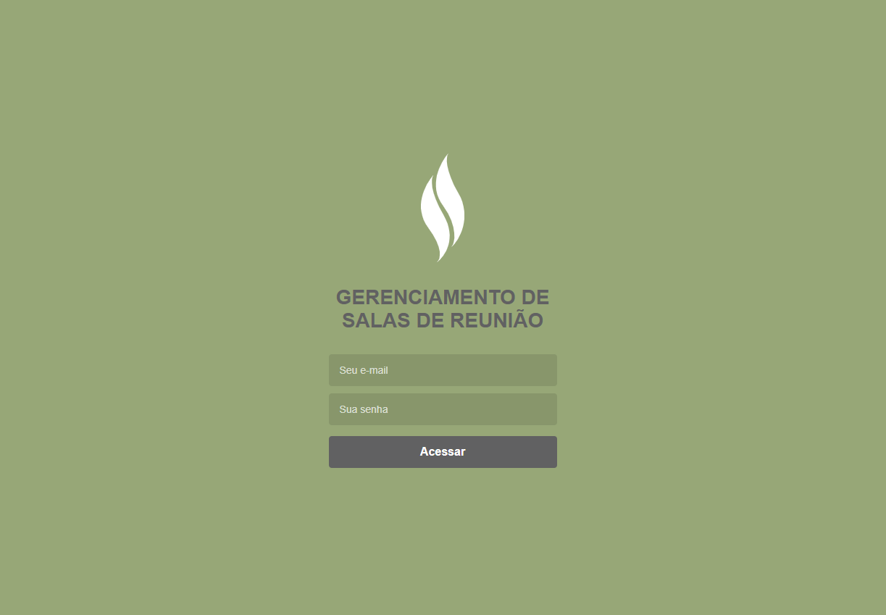

# Teste SmarAPD
### Frontend do sistema de reserva de salas de reunião
Por Erick Vieira

Este repositório é dedicado ao frontend do sistema de reserva de salas de reunião proposto como teste da empresa SmarAPD.
Esta aplicação foi construída utilizando o **React JS** e consome a API REST contida na pasta *backend* desse reposítorio. Com essa aplicação é possível realizar o login no sistema e agendar uma reunião com data e hora para início e término, sistema agendará a reunião ou retornará uma mensagem para avisar que a sala já está ocupada.

## Índice

<!--ts-->

* [Como usar?](#como-usar?)
* [Construído com](#construído-com)
* [Versionamento](#versionamento)
* [Autor](#autor)
* [Licença](#licença)

<!--te-->

### Como usar?

Após a clonagem desse repositório, você devera abrir um terminal de comando na pasta raiz desse projeto, ou navegar até ela através do terminal.
Para que seja possível utilizar é importa ter o [**Yarn Packger**](https://yarnpkg.com/) instalado em sua máquina.
Com os passos acima feitos, rode *yarn* no terminal para que os pacotes e dependencias necessários sejam instalados, então rode *yarn start* para iniciar o frontend.
Antes de você realizar qualquer modificação uma tela como esse deverá ser exibida em seu navegador:

### Construído com

* [Javascript](https://www.javascript.com/)
* [Node.js](https://nodejs.org/en/)
* [React](https://pt-br.reactjs.org/)
* [Redux](https://redux.js.org/)
* [Redux Saga](https://github.com/redux-saga/redux-saga)
* [Axios](https://github.com/axios/axios)
* [Styled Components](https://styled-components.com/)

### Versionamento
Eu usei o [Git](https://git-scm.com/) para genrenciar o versionamento.

### Autor

* **Erick Vieira** [vieiraerick](https://github.com/vieiraerick)

### Licença

Este projeto está sob a licença GNU V3, veja [License.md](LICENSE) para mais detalhes.
